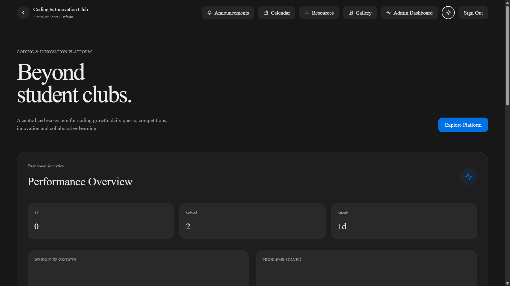

<div align="center">

# 🚀 Coding & Innovation Club Portal

**Full-stack club management platform with coding quests, leaderboard, compiler sandbox, and admin dashboard**

[](https://reactjs.org)
[](https://vitejs.dev)
[](https://expressjs.com)
[](https://mongodb.com)
[](https://docker.com)
[](LICENSE)

</div>

---

> A full-stack portal for the Coding & Innovation Club — students log in, solve daily coding quests, earn XP, track streaks, and climb the leaderboard. Admins manage members, announcements, events, resources, and gallery content through a dedicated dashboard. Code execution runs in a Dockerized sandbox.

---

## 📸 Demo

<!-- Add screenshot here -->


---

## ✨ Features

- **JWT Authentication** — role-based access for students and admins
- **Daily Coding Quests** — submit solutions, run against test cases, earn XP on pass
- **Live Compiler** — multi-language code execution in a Dockerized sandbox
- **Leaderboard** — ranked by XP, streak, solved count, and contest rating
- **Admin Dashboard** — full CRUD for members, quests, announcements, events, resources, gallery
- **Analytics** — student and admin dashboard metrics
- **File Uploads** — image uploads for resources and gallery
- **Activity Tracking** — XP, streaks, projects built, join date per member

---

## 🏗️ Architecture

```
React 19 + Vite (Frontend)
        ↓
src/services/api.js  (JWT bearer token on all requests)
        ↓
Express REST API (Backend)
        ↓
MongoDB (Users, Quests, Submissions, Events, Announcements, Resources, Gallery)
        ↓
Docker Sandbox (Code execution via /api/compiler/execute)
```

---

## 🛠️ Tech Stack

| Layer | Technology |
|---|---|
| Frontend | React 19, Vite, Tailwind CSS, React Router |
| Backend | Express.js, Node.js, Nodemon |
| Database | MongoDB, Mongoose |
| Auth | JWT, role-based middleware |
| Compiler | Dockerized sandbox, online compiler client |
| Uploads | Multer (image upload utility) |
| Deployment | Docker Compose |

---

## 🚀 Getting Started

### Prerequisites

- Node.js 18+
- MongoDB (local or Atlas)
- Docker Desktop (for compiler sandbox)

### Frontend Setup

```bash
# Install and run
npm install
npm run dev
```

Vite proxies `/api` to `http://localhost:5000` — keep the backend running on port 5000.

### Backend Setup

```bash
cd backend
npm install
npm run dev
```

### Compiler Sandbox (Docker)

```bash
# Build sandbox image
bash BUILD_SANDBOX.SH

# Start API + MongoDB services
docker compose up -d
```

---

## 📡 API Routes

| Route | Description |
|---|---|
| `/api/auth` | Register, login, profile, current user |
| `/api/quests` | Daily coding quest CRUD |
| `/api/submissions` | Submit and review quest solutions |
| `/api/compiler` | Code execution, templates, runtimes, XP awards |
| `/api/leaderboard` | Ranked user list |
| `/api/members` | Admin member management + XP updates |
| `/api/analytics` | Student and admin dashboard metrics |
| `/api/announcements` | Announcement CRUD |
| `/api/events` | Calendar event CRUD |
| `/api/resources` | Learning resource CRUD with image uploads |
| `/api/gallery` | Gallery image CRUD and stats |

---

## 📁 Project Structure

```
cic-website/
├── src/
│   ├── App.jsx                     # Routes + auth/theme context
│   ├── main.jsx                    # Entry point
│   ├── index.css                   # Tailwind + dark mode overrides
│   └── services/api.js             # API wrapper with JWT handling
├── backend/
│   ├── server.js                   # Express entry point
│   ├── config/db.js                # MongoDB connection
│   ├── middleware/auth.js          # JWT + admin middleware
│   ├── routes/                     # All route handlers
│   ├── models/                     # Mongoose models
│   └── utils/
│       ├── upload.js               # Image upload helper
│       └── dockerCompilerClient.js # Docker sandbox integration
├── docker-compose.yml              # API + MongoDB services
├── Dockerfile.sandbox              # Compiler sandbox image
└── BUILD_SANDBOX.SH                # Sandbox build script
```

---

## 🔐 Auth Flow

1. Student or admin signs in via the React auth page
2. Backend validates credentials and returns a JWT
3. Frontend stores JWT and attaches it as a bearer token on all API calls
4. Protected routes resolve `req.user` from the JWT
5. Admin-only routes use the `admin` middleware

---

## 📄 License

MIT © [Ishaan Nandoskar](https://github.com/ishaannandoskar-05)
